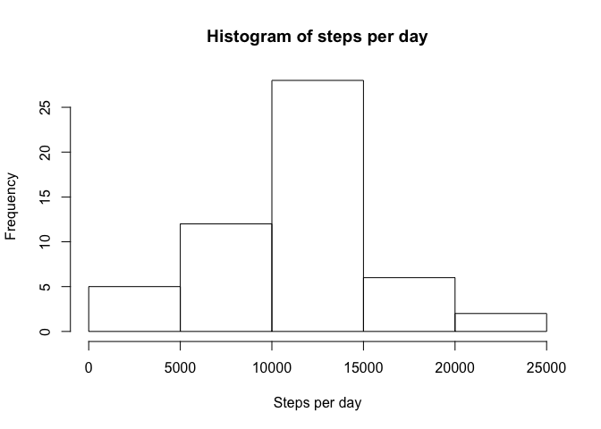
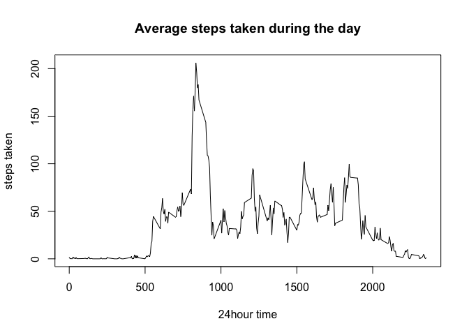
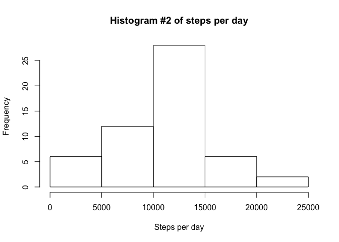
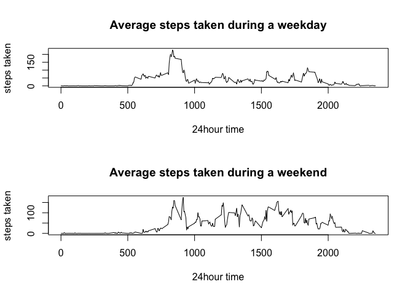

This is an analysis of steps taken throughout the day, separated by 5
minute time intervals. It was collected between 2012-10-01 and
2012-11-30

Total Number of Steps Taken Per Day
-----------------------------------

    TotalStepsByDate = aggregate(steps ~ date,data = activity_data, FUN=sum)
    hist(TotalStepsByDate$steps, main ='Histogram of steps per day', xlab = 'Steps per day')

Median and mean steps per day
-----------------------------

The mean number of steps taken per day is 10766.19 and the median number
of steps is 10765

Average Daily Activity Pattern
------------------------------

    AverageStepsByInterval = aggregate(steps ~ interval, data = activity_data, FUN = mean)
    plot(AverageStepsByInterval$interval, AverageStepsByInterval$steps, type="l", xlab = '24hour time', ylab = 'steps taken', main = 'Average steps taken during the day')

Interval with maximum average steps
-----------------------------------

On average, the 835 interval has the highest amount of steps - 206.1698
on average

For fun, we decided to fill in all the intervals where steps weren't
recorded. We used the median amount of steps for that interval to fill
in missing data. This changes our dataset somewhat.

    activity_data_noNAs = activity_data
    MedianStepsByInterval = aggregate(steps ~ interval, data = activity_data, FUN = median)
    activity_data_noNAs[is.na(activity_data$steps),1]=MedianStepsByInterval[which(MedianStepsByInterval$'interval' == activity_data[is.na(activity_data$steps),3]),2]

    noNA_TotalStepsPerDay = aggregate(steps ~ date, activity_data_noNAs, FUN = sum)
    hist(noNA_TotalStepsPerDay$steps,main ='Histogram #2 of steps per day', xlab = 'Steps per day')

New median / mean with modified data
------------------------------------

Our new median is 10682.5 and mean is 10587.94. Unlike the raw
unmodified dataset, our median and mean are further apart, and lower.

Differences in activity between weekdays and weekend
----------------------------------------------------

    Sys.setenv(TZ="Europe/Berlin")
    activity_data_noNAs$dayType = 'weekday'
    activity_data_noNAs[is.weekend(activity_data_noNAs$date),4] = 'weekend'
    meanStepsDailyByDayType = aggregate(steps ~ interval + dayType, data = activity_data_noNAs,FUN=mean)

    par(mfrow = c(2,1) )
    #plot(meanStepsDailyByDayType[which(meanStepsDailyByDayType$dayType == 'weekday'),], )
    plot(meanStepsDailyByDayType[which(meanStepsDailyByDayType$dayType == 'weekday'),]$interval, meanStepsDailyByDayType[which(meanStepsDailyByDayType$dayType == 'weekday'),]$steps, type="l", xlab = '24hour time', ylab = 'steps taken', main = 'Average steps taken during a weekday')
    plot(meanStepsDailyByDayType[which(meanStepsDailyByDayType$dayType == 'weekend'),]$interval, meanStepsDailyByDayType[which(meanStepsDailyByDayType$dayType == 'weekend'),]$steps, type="l", xlab = '24hour time', ylab = 'steps taken', main = 'Average steps taken during a weekend')

So in these recordings, people on weekends start moving later but on
average seem to move more.
